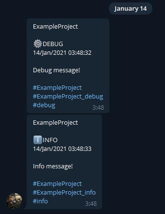

# pytelelogger
**pytelelogger** allows you to use Telegram bots to track your project logs in real-time.

# Installation
#### Dependencies
- python-telegram-bot>=13.1
- PyYAML>=5.3.1

#### User installation
The easiest way to install pytelelogger is ``pip``:\
``pip install pytelelogger``

# How to use
#### 1. Create Telegram bot
Check official Telegram documentation at ``https://core.telegram.org/bots`` and follow a few simple steps to create a bot. You will get an access token which is used to control your bot.
#### 2. Create cfg.yaml file
Example config file looks like this:
```yaml
# define bot access token, your Telegram username and your project name
token: YOUR_TOKEN
username: YOUR_USERNAME
project: "YOUR PROJECT NAME"

# set logging level
# DEBUG = 0
# INFO = 1
# WARNING = 3
# ERROR = 4
# CRITICAL = 5
level: 0

# set paths for duplicate files
# you can use one file to store everything (single), but using separate files (multi) is more convenient
mode: multi

# in case of single mode, debug key must store path to file
paths:
  debug: debug.txt
  info: info.txt
  warning: warning.txt
  error: error.txt
  critical: critical.txt

# customize key phrase
greeting: I'm ready!

# datetime format string that will be used in logging
dtf: "%d/%b/%Y %H:%M:%S"

# emojis to use in messages (debug, info, warning, error, critical)
emojis:
  debug: "⚙"
  info: "ℹ"
  warning: "⚠"
  error: "❌"
  critical: "🔴"
```
Later, ``chat_id`` field will be added to config file. Please, don't remove it.

#### 3. Add some code
```python
from pytelelogger import TeleLogger

if __name__ == '__main__':
    tl = TeleLogger('cfg.yaml')
    tl.debug('Debug message!')
    tl.info('Info message!')

    tl.stop(force=True)
```
You will get messages like this:\
\
And all logs are duplicated into files:
```text
[DEBUG:14/Jan/2021 03:48:32] Debug message!
```

```text
[INFO:14/Jan/2021 03:48:33] Info message!
```

# Development
#### Source code
The latest source code is available at:\
``https://github.com/SN4KEBYTE/pytelelogger``

#### Contributing
Feel free to open issues, send pull requests and review other users.